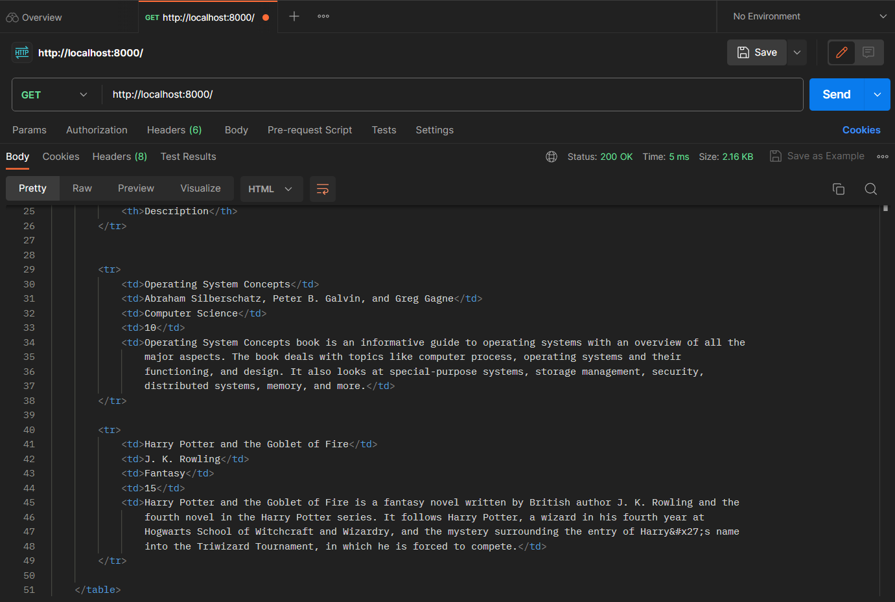
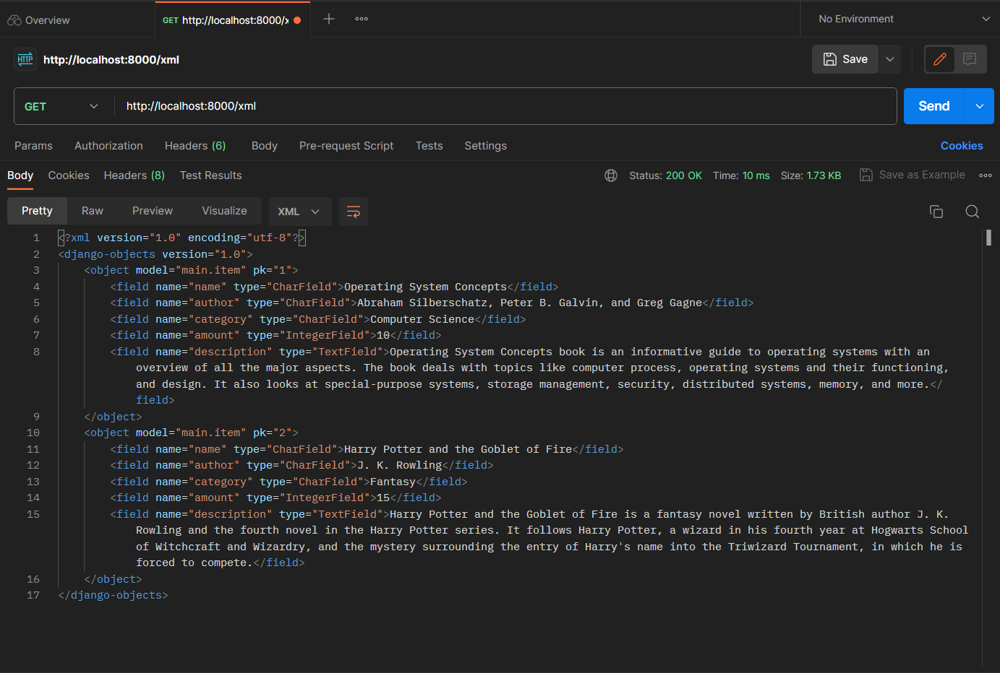
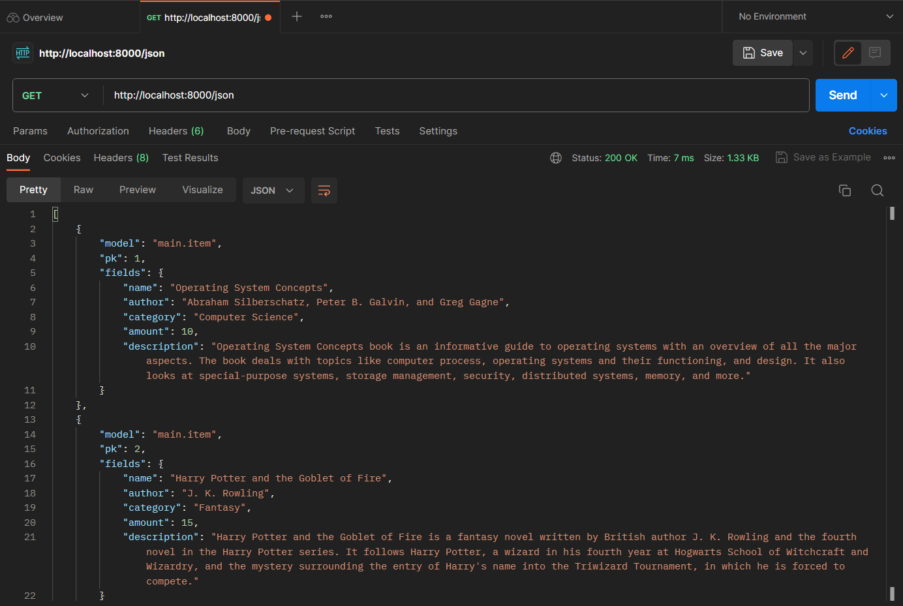
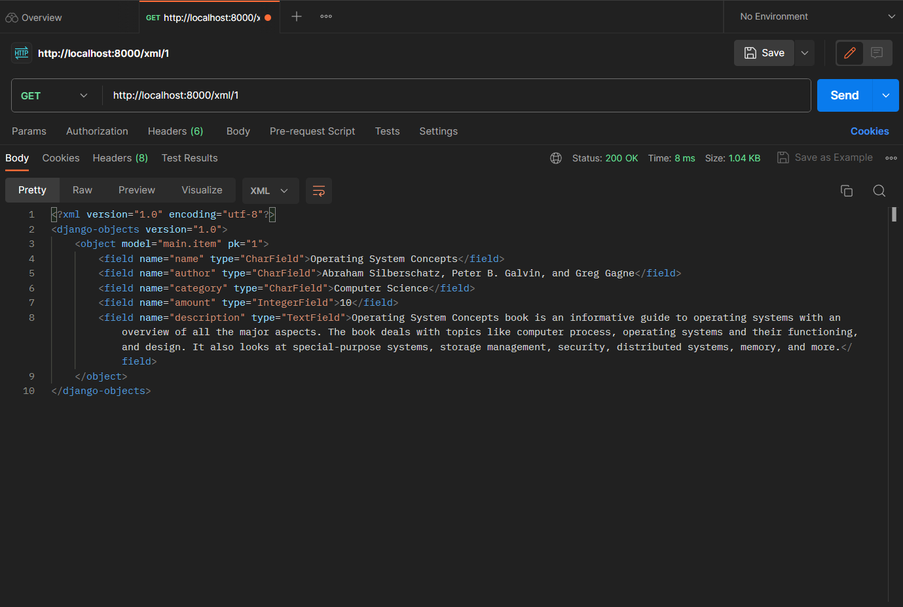
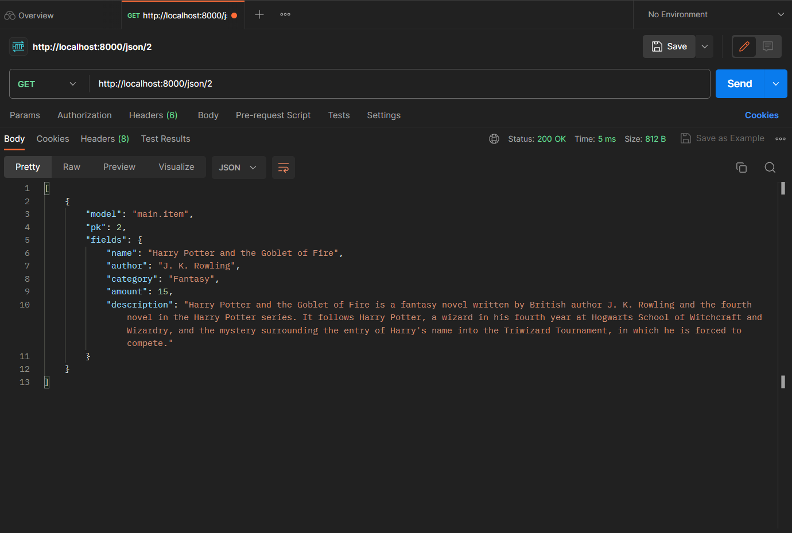

# Library Management System

🌐[Link Aplikasi](https://youtu.be/dQw4w9WgXcQ?si=4shjklB1tHnOYQMi)🌐

Nama: Fahmi Ramadhan<br>
NPM: 2206026473<br>
Kelas: PBP A<br>

# Tugas 6: JavaScript dan Asynchronous JavaScript

<details open>

## Perbedaan antara _asynchronous programming_ dengan _synchronous programming_.

Pada _synchronous programming_, program berjalan secara sekuensial atau berurutan. Artinya, operasi dieksekusi satu per satu dan menunggu hingga operasi sebelumnya selesai agar bisa melanjutkan ke operasi berikutnya.

Sementara itu, pada _asynchronous programming_, program dapat berjalan secara paralel atau bersamaan. Artinya, program tidak perlu menunggu suatu operasi selesai agar dapat melanjutkan ke operasi berikutnya. Untuk mengimplementasikan _asynchronous programming_, dapat digunakan konsep seperti _callback_, _promise_, atau _async_/_await_ dalam javascript. 

## Dalam penerapan JavaScript dan AJAX, terdapat penerapan paradigma event-driven programming. Jelaskan maksud dari paradigma tersebut dan sebutkan salah satu contoh penerapannya pada tugas ini.

Event-driven programming adalah sebuah paradigma di mana suatu kode dapat menunggu terjadinya suatu event/peristiwa terjadi sebelum kode tersebut dieksekusi. Contohnya, pada tugas kali ini, ada tombol untuk menambahkan buku dengan id `button_add` yang akan menjalankan fungsi `addBook` ketika terjadi event `onclick` (tombok diklik).

## Jelaskan penerapan _asynchronous programming_ pada AJAX.

Penerapan _asynchronous programming_ pada AJAX memungkinkan _request_ ke server dan penanganan _response_ dilakukan secara _asynchronous_. Artinya, program javascript tidak akan terhenti saat menunggu _response_ dari server. Penerapannya dapat dilakukan dengan menambahkan `async` dan `await` pada javascript. Fungsi `async` digunakan untuk menandai fungsi sebagai fungsi yang dapat mengembalikan nilai secara _asynchronous_, sedangkan fungsi `await` digunakan untuk menunggu hasil dari fungsi `async`. Berikut adalah contoh penerapannya pada tugas ini.
```javascript
async function getItems() {
    return fetch("").then((res) => res.json())
}

async function refreshItems() {
    ...
    const books = await getItems()
    ...
}
```

## Pada PBP kali ini, penerapan AJAX dilakukan dengan menggunakan Fetch API daripada library jQuery. Bandingkanlah kedua teknologi tersebut dan tuliskan pendapat kamu teknologi manakah yang lebih baik untuk digunakan.

### 1. Fetch API
- Lebih banyak didukung oleh browser modern
- Menggunakan _fetch_ dan _response_
- Lebih ringan karena hanya menggunakan javascript standar.
- Menggunakan _promise_ untuk handle kode _asynchronous_.

### 2. JQuery
- Merupakan library eksternal javascript yang telah ada sejak lama dan telah digunakan secara luas di web.
- Menggunakan callback _success_ dan _error_
- Lebih berat karena menggunakan library eksternal.
- Menggunakan callback untuk handle kode _asynchronous_.

Menurut saya, pilihan antara Fetch API dan JQuery tergantung pada kebutuhan proyek dan preferensi pribadi. Namun secara keseluruhan, Fetch API lebih bagus untuk digunakan untuk pengembangan aplikasi web modern yang ringan karena tidak perlu menggunakan library eksternal.

## Implementasi _Checklist_

### 1. Ubahlah kode cards data item agar dapat mendukung AJAX GET dan lakukan pengambilan item menggunakan AJAX GET.

Membuat fungsi _views_ baru untuk get item.
```python
def get_item_json(request):
    books = Item.objects.filter(user=request.user)
    return HttpResponse(serializers.serialize('json', books))
```

Menambahkan path-nya ke `urls.py`
```python
urlpatterns = [
    ...
    path('get-item/', get_item_json, name='get_item_json'),
    ...
]
```

Membuat _async function_ untuk get item.
```javascript
async function getItems() {
    return fetch("").then((res) => res.json())
}
```

Mengubah table menjadi cards
```html
<div class="grid grid-cols-1 gap-4 mt-4" id="books_card"></div>
```

Membuat _async function_ untuk refresh item.
```javascript
async function refreshItems() {
    document.getElementById("books_card").innerHTML = ""
    const books = await getItems()

    if (books.length != 0) { 
        let htmlString = ""
        let totalBooks = 0
        books.forEach((book, index) => {
            const isLast = index === books.length - 1;
            totalBooks += book.fields.amount
            htmlString += `\n
            <div class="bg-white last:bg-blue-200 rounded-lg shadow-lg overflow-hidden">
                <div class="px-6 py-4">
                    <div class="font-bold text-xl">${ book.fields.name }</div>
                    <p class="text-gray-700 text-base mb-2">by ${ book.fields.author }</p>
                    <p class="text-gray-700 text-base">${ book.fields.description }</p>
                </div>
                <div class="px-6">
                    <span class="inline-block bg-blue-100 rounded-full px-3 py-1 text-sm font-semibold text-gray-700 mr-2">Amount: ${ book.fields.amount }</span>
                    <span class="inline-block bg-blue-100 rounded-full px-3 py-1 text-sm font-semibold text-gray-700 mr-2">${ book.fields.category }</span>
                </div>
                <div class="flex space-x-2 px-6 py-4">
                    <div>
                        <button type="submit" name="Increment" onclick="incrementBook(${book.pk})" class="bg-blue-500 hover:bg-blue-700 text-white font-bold py-2 px-4 rounded mr-2">Add one book</button>
                    </div>
                    <div>
                        <button type="submit" name="Decrement" onclick="decrementBook(${book.pk})" class="bg-blue-500 hover:bg-blue-700 text-white font-bold py-2 px-4 rounded mr-2">Subtract one book</button>
                    </div>
                    <div>
                        <button type="submit" name="Delete" onclick="deleteBook(${book.pk})" class="bg-red-500 hover:bg-red-700 text-white font-bold py-2 px-4 rounded">Delete book(s)</button>
                    </div>
                </div>
            </div>`
        })

        document.getElementById("book_count").innerHTML = `There are currently 
        <span class="font-bold">${totalBooks}</span> book(s) with
        <span class="font-bold">${books.length}</span> book title(s) stored in the system`
        document.getElementById("books_card").innerHTML = htmlString
    } 
    else {
        document.getElementById("book_count").innerHTML = `<h5 class="font-bold text-xl">
        There are no books stored in the system for this account</h5>`
    }  
}
```

### 2. Membuat sebuah tombol yang membuka sebuah modal dengan _form_ untuk menambahkan buku.

Menambahkan button pada header untuk menambahkan buku.
```html
<button id="open" class="bg-blue-100 hover:bg-blue-700 hover:text-white text-blue-500 font-bold py-2 px-4 rounded">
    Add New Book
</button>
```

Membuat modals untuk menambahkan buku.
```html
<!-- Overlay element -->
<div id="overlay" class="fixed hidden z-40 w-screen h-screen inset-0 bg-gray-900 bg-opacity-60"></div>

<!-- The dialog -->
<div id="dialog"
    class="hidden fixed z-50 top-1/2 left-1/2 -translate-x-1/2 -translate-y-1/2 w-96 bg-white rounded-md px-8 py-6 space-y-5 drop-shadow-lg">
    <h1 class="text-2xl font-bold">Add New Book</h1>
    <div class="py-5 border-t border-b border-blue-500">
        <form id="form" onsubmit="return false;">
            
            <div class="mb-3 flex">
                <label for="name" class="font-bold mr-4 mt-2">Name:</label>
                <input type="text" class="form-control w-full px-1 rounded-md shadow-sm border-gray-500 border" id="name" name="name">
            </div>
            <div class="mb-3 flex">
                <label for="author" class="font-bold mr-4 mt-2">Author:</label>
                <input type="text" class="form-control w-full px-1 rounded-md shadow-sm border-gray-500 border" id="author" name="author">
            </div>
            <div class="mb-3 flex">
                <label for="category" class="font-bold mr-4 mt-2">Category:</label>
                <input type="text" class="form-control w-full px-1 rounded-md shadow-sm border-gray-500 border" id="category" name="category">
            </div>
            <div class="mb-3 flex">
                <label for="amount" class="font-bold mr-4 mt-2">Amount:</label>
                <input type="number" class="form-control w-full px-1 rounded-md shadow-sm border-gray-500 border" id="amount" name="amount">
            </div>
            <div class="mb-3">
                <label for="description" class="font-bold">Description:</label>
                <textarea class="form-control mt-2 block w-full px-1 rounded-md shadow-sm border-gray-500 border" id="description" name="description"></textarea>
            </div>
        </form>
    </div>
    <div class="flex justify-end">
        <!-- This button is used to close the dialog -->
        <button type="button" id="close" class="bg-gray-500 hover:bg-gray-700 text-white font-bold py-2 px-4 rounded mr-2">
            Close
        </button>
        <!-- This button is used to submit the form -->
        <button type="button" id="button_add" class="bg-blue-500 hover:bg-blue-700 text-white font-bold py-2 px-4 rounded">
            Add Book
        </button>
    </div>
</div>
```

Menambahkan script untuk membuka dan menutup modal.

```javascript
var openButton = document.getElementById('open')
var dialog = document.getElementById('dialog')
var closeButton = document.getElementById('close')
var overlay = document.getElementById('overlay')

// show the overlay and the dialog
openButton.addEventListener('click', function () {
    dialog.classList.remove('hidden')
    overlay.classList.remove('hidden')
});

// hide the overlay and the dialog
closeButton.addEventListener('click', function () {
    dialog.classList.add('hidden')
    overlay.classList.add('hidden')
});
```

### 3. Membuat fungsi _view_ baru untuk menambahkan buku ke dalam basis data.

```python
@csrf_exempt
def add_item_ajax(request):
    if request.method == 'POST':
        name = request.POST.get("name")
        author = request.POST.get("author")
        category = request.POST.get("category")
        amount = request.POST.get("amount")
        description = request.POST.get("description")
        user = request.user

        new_book = Item(name=name, author=author, category=category, amount=amount, description=description, user=user)
        new_book.save()

        return HttpResponse(b"CREATED", status=201)

    return HttpResponseNotFound()
```

**Bonus**: Menambahkan fungsi ajax delete, add, dan decrement.

```python
@csrf_exempt
def delete_item_ajax(request, book_id):
    if request.method == 'DELETE':
        book = Item.objects.get(pk=book_id, user=request.user)
        book.delete()
        return HttpResponse(b"OK", status=200)

    return HttpResponseNotFound()

@csrf_exempt
def add_book_amount_ajax(request, book_id):
    if request.method == 'POST':
        book = Item.objects.get(pk=book_id, user=request.user)
        book.amount += 1
        book.save()
        return HttpResponse(b"OK", status=200)
    
    return HttpResponseNotFound()

@csrf_exempt
def dec_book_amount_ajax(request, book_id):
    if request.method == 'POST':
        book = Item.objects.get(pk=book_id, user=request.user)
        book.amount -= 1
        if book.amount < 0:
            book.amount = 0
        book.save()
        return HttpResponse(b"OK", status=200)
    
    return HttpResponseNotFound()
```

### 4. Membuat path `/create-ajax/` yang mengarah ke fungsi _view_ (termasuk untuk bonus).

```python
urlpatterns = [
    ...
    path('create-ajax/', add_item_ajax, name='add_item_ajax'),
    path('delete-ajax/<int:book_id>', delete_item_ajax, name='delete_item_ajax'),
    path('add-book-amount-ajax/<int:book_id>', add_book_amount_ajax, name='add_book_amount_ajax'),
    path('dec-book-amount-ajax/<int:book_id>', dec_book_amount_ajax, name='dec_book_amount_ajax'),
]
```

### 5. Hubungkan form yang telah kamu buat di dalam modal kamu ke path `/create-ajax/`.

Menambahkan _async function_ untuk menghubungkan modal pada `main.html` ke path `/create-ajax/` serta bonus (delete, add, dec)
```javascript
function addBook() {
    fetch("", {
        method: "POST",
        body: new FormData(document.querySelector('#form'))
    }).then(refreshItems)

    document.getElementById("form").reset()
    dialog.classList.add('hidden')
    overlay.classList.add('hidden')

    return false
}

document.getElementById("button_add").onclick = addBook

function deleteBook(book_id) {
    fetch(`delete-ajax/${book_id}`, {
        method: "DELETE",
    }).then(refreshItems)

    return false
}

function incrementBook(book_id) {
    fetch(`add-book-amount-ajax/${book_id}`, {
        method: "POST",
    }).then(refreshItems)

    return false
}

function decrementBook(book_id) {
    fetch(`dec-book-amount-ajax/${book_id}`, {
        method: "POST",
    }).then(refreshItems)

    return false
}
```

### 6. Lakukan refresh pada halaman utama secara asinkronus untuk menampilkan daftar item terbaru tanpa reload halaman utama secara keseluruhan.

Menambahkan `refreshItems()` pada tag `<script></script>`.

### 7. Melakukan perintah `collectstatic`.

Menjalankan perintah `python manage.py collectstatic` untuk mengumpulkan berkas static dari setiap aplikasi ke dalam suatu folder yang dapat dengan mudah disajikan pada produksi.

### 8. Melakukan deployment.

1. Menambahkan `django-environ` pada `requirements.txt`
2. Menjalankan perintah `pip install -r requirements.txt`
3. Membuat berkas `Procfile`` yang berisi:
```
release: django-admin migrate --noinput
web: gunicorn library_app.wsgi
```
4. Membuat berkas `pbp-deploy.yml` pada folder `.github\workflows` yang berisi:
```
name: Deploy

on:
  push:
    branches:
      - main
      - master

jobs:
  Deployment:
    if: github.ref == 'refs/heads/master'
    runs-on: ubuntu-latest
    steps:
    - name: Cloning repo
      uses: actions/checkout@v4
      with:
        fetch-depth: 0

    - name: Push to Dokku server
      uses: dokku/github-action@master
      with:
        branch: 'main'
        git_remote_url: ssh://dokku@${{ secrets.DOKKU_SERVER_IP }}/${{ secrets.DOKKU_APP_NAME }}
        ssh_private_key: ${{ secrets.DOKKU_SSH_PRIVATE_KEY }}
```
5. Membuat berkas `.dockerignore` yang berisi:
```
**/*.pyc
**/*.pyo
**/*.mo
**/*.db
**/*.css.map
**/*.egg-info
**/*.sql.gz
**/__pycache__/
.cache
.project
.idea
.pydevproject
.idea/workspace.xml
.DS_Store
.git/
.sass-cache
.vagrant/
dist
docs
env
logs
src/{{ project_name }}/settings/local.py
src/node_modules
web/media
web/static/CACHE
stats
Dockerfile
.gitignore
Dockerfile
db.sqlite3
**/*.md
logs/
```

6. Membuat berkas `Dockerfile` yang berisi:
```
FROM python:3.10-slim-buster

WORKDIR /app

ENV PYTHONUNBUFFERED=1 \
    PYTHONPATH=/app \
    DJANGO_SETTINGS_MODULE=library_app.settings \
    PORT=8000 \
    WEB_CONCURRENCY=2

# Install system packages required Django.
RUN apt-get update --yes --quiet && apt-get install --yes --quiet --no-install-recommends \
&& rm -rf /var/lib/apt/lists/*

RUN addgroup --system django \
    && adduser --system --ingroup django django

# Requirements are installed here to ensure they will be cached.
COPY ./requirements.txt /requirements.txt
RUN pip install -r /requirements.txt

# Copy project code
COPY . .

RUN python manage.py collectstatic --noinput --clear

# Run as non-root user
RUN chown -R django:django /app
USER django

# Run application
# CMD gunicorn library_app.wsgi:application
```

7. Menambahkan `import environ` dan `import os` pada `settings.py`

8. Menambahkan kode `env = environ.Env()` setelah baris kode `BASE_DIR`.

9. Menambahkan kode berikut setelah baris kode `SECRET_KEY`. 
```python
PRODUCTION = env.bool('PRODUCTION', False)
```

10. Menambahkan kode berikut setelah bagian kode `DATABASES`.

```python
if PRODUCTION:
    DEBUG = False
    DATABASES = {
        'default': env.db('DATABASE_URL')
    }
    DATABASES["default"]["ATOMIC_REQUESTS"] = True
```

11. Mengatur static url.
```python
STATIC_URL = '/static/'

STATIC_ROOT = os.path.join(BASE_DIR, 'static')

STATICFILES_STORAGE = 'whitenoise.storage.CompressedManifestStaticFilesStorage'
```

12. Menambahkan middleware whitenoise.
```python
MIDDLEWARE = [
    ...
    'whitenoise.middleware.WhiteNoiseMiddleware',
    ...
]
```

</details>

# Tugas 5: Desain Web Menggunakan HTML, CSS dan FrameWork CSS

<details>

## Manfaat dari setiap _element selector_ dan kapan waktu yang tepat untuk menggunakannya.

- _Universal Selector_ digunakan untuk memilih semua elemen HTML pada halaman. _selector_ ini cocok digunakan ketika ingin _reset style_ atau ketika ingin memberikan _style_ umum pada semua elemen dalam halaman, misalnya mengatur jenis _font_ (`* {}`).

- _Element Selector_ digunakan untuk memilih semua elemen HTML dengan nama elemen tertentu (misalnya, semua `<p>`). _Selector_ ini cocok digunakan ketika ingin memberikan _style_ umum pada semua elemen dengan jenis tertentu. (`p {}`).

- _Class Selector_ digunakan untuk memilih elemen berdasarkan atribut `class` yang diberikan. Dikarenakan beberapa elemen bisa memiliki `class` yang sama dengan elemen lainnya, kita bisa mengelompokkan elemen-elemen tersebut dalam kelas-kelas tertentu. Oleh karena itu, _selector_ ini cocok digunakan ketika ingin memberikan _style_ pada kelompok elemen dengan class tertentu yang sama (`.nama-class {}`).

- _ID Selector_ digunakan untuk memilih elemen berdasarkan atribut `id` yang diberikan. Berbeda dengan `class`, atribut `id` bersifat unik untuk setiap elemen dalam satu file `html`. Oleh karena itu, _selector_ ini cocok digunakan ketika ingin memberikan _style_ atau manipulasi spesifik pada elemen tertentu dengan ID yang unik (`.value-id {}`).

- _Descendant Selector_ digunakan untuk memilih elemen dalam hierarki tertentu. _Selector_ ini cocok digunakan ketika ingin memberikan _style_ pada semua elemen tertentu yang berada di dalam elemen tertentu, misalnya semua elemen `<li>` dalam elemen `<ul>` (`ul li {}`). 

- _Adjacent Selector_ digunakan untuk memilih suatu elemen yang bersebelahan dalam tingkat hierarki yang sama. _Selector_ ini cocok digunakan ketika ingin memberikan _style_ suatu elemen yang tepat didahului oleh suatu elemen tertentu, misalnya elemen `<p>` yang tepat setelah elemen `<h1>` (`h1 + p {}`).

- _Direct-Descendant Selector_ digunakan untuk memilih suatu elemen yang berada dalam elemen tertentu dan hanya berbeda satu tingkat hierarki. _Selector_ ini cocok digunakan ketika ingin memberikan _style_ misalnya pada elemen `<li>` yang berada satu tingkat di dalam elemen `<ul>` (`ul > li {}`).

- _Attribute Selector_ digunakan untuk memilih semua elemen yang atributnya diset memiliki nilai yang sama. Selector_ ini cocok digunakan ketika ingin memberikan _style_ misalnya pada elemen `input` yang atribut `type`-nya diset ke `"text"` (`input[type="text"] {}`).

## Penjelasan HTML5 Tag

- `<nav>`: Tag ini adalah sebuah _semantic tag_ yang digunakan untuk menentukan bagian navigasi pada halaman web yang biasanya terdapat pada bagian atas halaman web dan berisikan tautan menuju halaman lain pada web tersebut.
- `<table>`, `<tr>`, `<th>`, dan `<td>`: Tag ini digunakan untuk membuat tabel dan mengatur elemen-elemen dalam tabel. `<tr>` untuk _table row_, `<th>` untuk _table header_, dan `<td>` untuk _table data_.
- `<title>`: Tag ini digunakan untuk menentukan judul halaman web yang akan ditampilkan pada _tab_ judul _browser_.
- `<a>`: Tag ini digunakan untuk membuat tautan atau _hyperlink_ ke halaman web atau sumber daya lainnya. Tag ini memiliki atribut paling penting yaitu `href` yang digunakan untuk menentukan alamat URL yang akan dituju saat tautan diklik.
- `<div>`: Tag ini adalah sebuah _semantic tag_ yang digunakan untuk mengelompokkan dan mengatur elemen-elemen HTML menjadi blok-blok konten. ini adalah elemen "divisi" yang umum digunakan untuk membuat wadah yang dapat diatur dan diberi _style_ dengan CSS.

## Perbedaan antara _margin_ dan _padding_

### 1. _Margin_
- _Margin_ adalah area di luar batas elemen HTML yang memisahkan elemen tersebut dari elemen-elemen lain di sekitarnya.
- Ketika mengatur _margin_ suatu elemen, jarak antara elemen tersebut dengan elemen-elemen lain di sekitarnya akan berubah.

### 2. _Padding_
- _Padding_ adalah area yang terletak di dalam elemen, di antara batas elemen dan kontennya sendiri.
- Ketika mengatur padding suatu elemen, yang diubah adalah seberapa jauh konten elemen tersebut dari batas elemen tersebut, sehingga tidak memengaruhi elemen-elemen lain di sekitarnya.

## Perbedaan antara _framework_ CSS Tailwind dan Bootstrap. Kapan sebaiknya kita menggunakan Bootstrap daripada Tailwind, dan sebaliknya?

### 1. Tailwind CSS
- Tailwind CSS mengikuti pendekatan "_utility-first_", yang berarti _framework_ ini memberikan sejumlah besar kelas utilitas yang dapat ditambahkan langsung ke elemen HTML untuk merancang tampilan.
- Tailwind CSS memiliki _file_ CSS yang lebih kecil sedikit dibandingkan Bootstrap serta hanya akan memuat kelas-kelas utilitas yang ada.
- Tailwind CSS memberikan fleksibilitas dan adaptabilitas yang tinggi terhadap proyek.
- Tailwind CSS memerlukan pengetahuan CSS yang lebih dalam karena kita akan bekerja dengan banyak kelas utilitas untuk merancang tampilan.

### 2. Bootstrap
- Bootstrap memiliki desain yang lebih "_opinionated_". Ini berarti bahwa Bootstrap memiliki komponen-komponen yang telah dirancang dan ditata dengan baik, sehingga memungkinkan kita untuk membangun tampilan dengan cepat tanpa banyak penyesuaian.
- Bootstrap cenderung memiliki ukuran _file_ yang lebih besar karena menyediakan banyak komponen dan _style_ yang sudah jadi.
- Bootstrap sering kali menghasilkan tampilan yang lebih konsisten di seluruh proyek karena menggunakan komponen yang telah didefinisikan.
- Bootstrap lebih mudah dipelajari oleh pemula atau mereka yang tidak memiliki pengetahuan CSS yang mendalam karena komponen-komponennya telah dirancang dan ditata dengan baik.

Kita dapat menggunakan Bootstrap ketika kita ingin membuat tampilan dengan cepat dan mudah, terutama jika kita tidak memiliki banyak pengalaman dalam desain tampilan atau CSS. Sementara itu, kita dapat menggunakan Tailwind CSS ketika kita ingin membuat tampilan dengan mudah dan cepat tetapi juga masih fleksibel sehingga desain tidak monoton.

## Implementasi _Checklist_

### Kustomisasi desain pada template HTML yang telah dibuat pada Tugas 4 dengan menggunakan CSS _framework_ Tailwind

Pertama-tama, saya menambahkan `<script src="https://cdn.tailwindcss.com"></script>` pada `base.html` agar dapat menggunakan Tailwind CSS. Kemudian, saya menambahkan atribut `class="bg-blue-100"` pada elemen _body_ di `base.html` agar semua halaman memiliki warna latar belakang yang sama.

### 1. Kustomisasi halaman `login`, `register`, dan `add_book`

#### a. Halaman `login`

- Memindahkan konten halaman login ke tengah halaman.
```html
<div class="flex justify-center items-center h-screen">
```
- Menambahkan background, padding, rounded corner, dan box shadow serta mengatur lebarnya menjadi full untuk layar kecil, 1/2 untuk layar medium, dan 1/3 untuk layar besar.
```html
<div class = "login bg-blue-50 p-8 rounded shadow-md w-full md:w-1/2 lg:w-1/3">
```
- Mengatur header "Login" agar memiliki font size 2xl, bold weight, serta menambahkan bottom margin.
```html
<h1 class="text-2xl font-bold mb-4">Login</h1>
```
- Pada _form_, saya mengubah tabel menjadi beberapa elemen `div` untuk _field_ _username_ dan _password_ serta tombol _login_ serta mengatur _style_-nya seperti berikut.
```html
<form method="POST" action="">
    
    <div class="mb-4">
        <label class="block font-bold mb-2" for="username">
            Username:
        </label>
        <input type="text" name="username" placeholder="Username" class="form-control w-full" id="username">
    </div>
    <div class="mb-4">
        <label class="block font-bold mb-2" for="password">
            Password:
        </label>
        <input type="password" name="password" placeholder="Password" class="form-control w-full" id="password">
    </div>
    <div class="flex justify-end">
        <button class="bg-blue-500 hover:bg-blue-700 text-white font-bold py-2 px-4 rounded" type="submit">
            Login
        </button>
    </div>
</form>
```
- Menambahkan margin top pada daftar _messages_ dan pada teks "Don't have an account yet?" serta "Register Now"
```html

    <ul class="mt-4">
        
            <li>{{ message }}</li>
        
    </ul>
     
    
<p class="mt-4">Don't have an account yet? <a href="" class="text-blue-500">Register Now</a></p>
```

#### b. Halaman `Register`

- Sama seperti halaman _login_, saya memindahkan konten halaman register ke tengah halaman.
```html
<div class="flex justify-center items-center h-screen">
```
- Menambahkan background, padding, rounded corner, dan box shadow serta mengatur lebarnya menjadi full untuk layar kecil dan 1/2 untuk layar medium atau lebih besar.
```html
<div class = "register bg-blue-50 p-8 rounded shadow-md w-full md:w-1/2">
```
- Mengatur header "Register" agar memiliki font size 2xl, bold weight, serta menambahkan bottom margin.
```html
<h1 class="text-2xl font-bold mb-4">Register</h1>
```
- Mengubah _form_ dan menambahkan _style_ menjadi seperti berikut:
```html
<form method="POST" >  
      
    <table class="w-full mb-4">  
        {{ form.as_table }}
    </table>
    <div class="flex justify-end">
        <button class="bg-blue-500 hover:bg-blue-700 text-white font-bold py-2 px-4 rounded" type="submit">
            Register
        </button>
    </div>
</form>
```
- Menambahkan margin top pada daftar _messages_ seperti pada halaman _login_.

#### c. Halaman `add_book`

- Masih sama seperti sebelumnya, saya memindahkan konten halaman add_book ke tengah halaman.
```html
<div class="flex justify-center items-center h-screen">
```
- Menambahkan background, padding, rounded corner, dan box shadow serta mengatur lebarnya menjadi full untuk layar kecil dan 1/3 untuk layar medium atau lebih besar.
```html
<div class = "add_book bg-blue-50 p-8 rounded shadow-md w-full md:w-1/3">
```
- Mengatur header "Add New Book" agar memiliki font size 2xl, bold weight, serta menambahkan bottom margin.
```html
<h1 class="text-2xl font-bold mb-4">Add New Book</h1>
```
- Mengubah _form_ dan menambahkan _style_ menjadi seperti berikut:
```html
<form method="POST">
    
    <table class="w-full mb-4">
        {{ form.as_table }}
    </table>
    <div class="flex justify-end">
        <button class="bg-blue-500 hover:bg-blue-700 text-white font-bold py-2 px-4 rounded" type="submit">
            Add Book
        </button>
    </div>
</form>
```

### 2. Kustomisasi halaman daftar buku

- Membuat _fixed header_ yang berisikan nama aplikasi dan tombol untuk menambahkan buku.
```html
<header class="bg-blue-500 shadow fixed w-full z-10">
    <div class="max-w-7xl mx-auto px-4 sm:px-6 lg:px-8">
        <div class="flex justify-between h-16">
            <div class="flex-shrink-0 flex items-center">
                <h1 class="text-white font-bold text-2xl">{{ app_name }}</h1>
            </div>
            <div class="flex items-center justify-end">
                <a href="">
                    <button class="bg-blue-100 hover:bg-blue-700 hover:text-white text-blue-500 font-bold py-2 px-4 rounded">
                        Add New Book
                    </button>
                </a>
            </div>
        </div>
    </div>
</header>
```
- Membungkus isi konten halaman dalam container dan mengaturnya agar berada di tengah halaman.
```html
<div class="flex justify-center">
    <div class="container mt-20">
        ...
    </div>
</div>
```
- Memindahkan tombol _log out_ agar berada di samping nama _user_ yang sedang _login_ serta memberikannya _style_ dan juga memindahkan informasi sesi _login_ terakhir ke bagian atas.
```html
<div class="flex mt-4">
    <h5 class="mt-1 mr-2">logged in as: <span class="font-bold">{{name}}</span></h5>
    <a href="">
        <button class="bg-red-500 hover:bg-red-700 text-white font-bold py-1 px-4 rounded" type="submit">
            Logout
        </button>
    </a>
</div>

<h5 class="mt-2">Last login session: {{ last_login }}</h5>
```
- Menambahkan blok `` sebelum menampilkan total buku dan tabel agar ketika tidak ada buku, _header_ tabel tidak ditampilkan. Kemudian, ditambahkan pesan tidak ada buku pada blok `else`-nya.
- Menambahkan `class="px-4 py-2 font-bold border-t border-b border-blue-500"` pada setiap _header_ tabel.
- Menambahkan `class="px-4 py-2 border-b border-blue-500 text-blue-500"` untuk setiap informasi buku pada tabel. Teks akan berwarna biru jika itu buku tersebut merupakan buku paling terakhir dalam daftar buku **(BONUS)**.
- Menambahkan atribut `title` pada tombol-tombol untuk _increment_ buku, _decrement_ buku, dan _remove_ buku sebagai _tooltip_ yang akan muncul ketika tombol di-_hover_.

</details>

# Tugas 4: Implementasi Autentikasi, Session, dan Cookies pada Django

<details>

## Apa itu Django `UserCreationForm` dan apa kelebihan dan kekurangannya?

`UserCreationForm` adalah salah satu form yang disediakan oleh _framework_ Django untuk mempermudah proses pembuatan _user_ dalam aplikasi web. Dengan adanya hal tersebut, kita tidak perlu susah-susah menulis kode dari awal untuk membuat _form_ dan validasi inputnya sehingga kita dapat menghemat waktu. Namun, `UserCreationForm` juga memiliki kekurangan karena bentuknya yang sederhana. Jika kita ingin menambahkan fitur yang kompleks, misalnya konfirmasi email atau CAPTCHA, kita harus menulis kode sendiri. 

## Apa perbedaan autentikasi dan otorisasi dalam konteks Django dan mengapa keduanya penting?

Autentikasi adalah proses untuk memverifikasi identitas pengguna yang mengakses suatu aplikasi, misalnya proses login dalam aplikasi web. Pada Django, terdapat method `authenticate` yang digunakan untuk mengautentikasi _username_ dengan _password_-nya. Sementara itu, otorisasi adalah proses untuk memverifikasi apakah pengguna yang sudah terautentikasi memiliki akses pada suatu fitur dalam aplikasi web tersebut. Misalnya, pada scele, pengguna terautentikasi yang memiliki role dosen memiliki hak akses yang berbeda dengan pengguna terautentikasi yang memiliki role mahasiswa.

Autentikasi dan otorisasi merupakan hal penting untuk diimplementasikan pada suatu aplikasi web. Dengan menggabungkan keduanya, kita bisa membuat aplikasi web yang aman dengan kontrol yang tepat atas siapa saja yang dapat melakukan hal tertentu.

## Apa itu _cookies_ dalam konteks aplikasi web dan bagaimana Django menggunakan cookies untuk mengelola data sesi pengguna?

_Cookies_ adalah sebuah potongan kecil dari data yang disimpan di sisi klien, yaitu _web browser_ dari pengguna, agar data tersebut dapat digunakan kembali dalam _request_ selanjutnya. _Cookies_ biasa digunakan dalam menyimpan token autentikasi, melacak aktivitas pengguna, dan menyimpan preferensi pengguna. _Cookies_ akan dihapus secara otomatis jika sudah mencapai waktu kedaluwarsanya. 

Django memiliki dukungan bawaan untuk mengelola data sesi pengguna. Django menyediakan API untuk membaca nilai _cookies_ dari HTTP _request_ yang diterima _browser_ pengguna dan kita bisa mengakses _value_ dari _dictionary_ `request.COOKIES`. Untuk mengatur atau membuat _cookies_ baru, kita bisa menggunakan `response.set_cookie()`. Kemudian, untuk penghapusan _cookies_ bisa menggunakan `response.delete_cookie()` 

## Apakah penggunaan cookies aman secara _default_ dalam pengembangan web atau apakah ada risiko potensial yang harus diwaspadai?

_Cookies_ bersifat aman karena ia hanya menyimpan data, bukan kode program, tidak dapat membaca atau menghapus data pada komputer pengguna. Namun, jika _cookies_ tidak diatur dengan baik, misalnya terdapat informasi personal di dalamnya, ada risiko data tersebut dicuri oleh suatu _script_, bukan _cookies_-nya yang mencuri.

## Implementasi _Checklist_

### 1. Mengimplementasikan fungsi registrasi, login, dan logout untuk memungkinkan pengguna untuk mengakses aplikasi sebelumnya dengan lancar.

Pertama-tama, saya membuka file `views.py` pada subdirektori `main` lalu mengimport _method-method_ yang dibutuhkan dan menambahkan fungsi `register`, `login`, dan `logout` berikut:

```python
def register(request):
    form = UserCreationForm()

    if request.method == "POST":
        form = UserCreationForm(request.POST)
        if form.is_valid():
            form.save()
            messages.success(request, 'Your account has been successfully created!')
            return redirect('main:login')
    context = {'form':form}
    return render(request, 'register.html', context)

def login_user(request):
    if request.method == 'POST':
        username = request.POST.get('username')
        password = request.POST.get('password')
        user = authenticate(request, username=username, password=password)
        if user is not None:
            login(request, user)
            return redirect('main:show_main')
        else:
            messages.info(request, 'Sorry, incorrect username or password. Please try again.')
    context = {}
    return render(request, 'login.html', context)

def logout_user(request):
    logout(request)
    return redirect('main:login')
```

Setelah itu, pada direktori `main/templates`, saya membuat berkas `register.html` dan `login.html` yang meng-_extends_ `base.html`.

1. `register.html`
```html



    <title>Register</title>


  

<div class = "login">
    
    <h1>Register</h1>  

        <form method="POST" >  
              
            <table>  
                {{ form.as_table }}  
                <tr>  
                    <td></td>
                    <td><input type="submit" name="submit" value="Daftar"/></td>  
                </tr>  
            </table>  
        </form>

      
        <ul>   
              
                <li>{{ message }}</li>  
                  
        </ul>   
    

</div>  


```

2. `login.html`
```html



    <title>Login</title>




<div class = "login">

    <h1>Login</h1>

    <form method="POST" action="">
        
        <table>
            <tr>
                <td>Username: </td>
                <td><input type="text" name="username" placeholder="Username" class="form-control"></td>
            </tr>
                    
            <tr>
                <td>Password: </td>
                <td><input type="password" name="password" placeholder="Password" class="form-control"></td>
            </tr>

            <tr>
                <td></td>
                <td><input class="btn login_btn" type="submit" value="Login"></td>
            </tr>
        </table>
    </form>

    
        <ul>
            
                <li>{{ message }}</li>
            
        </ul>
         
        
    Don't have an account yet? <a href="">Register Now</a>

</div>


```

Selanjutnya, saya menambahkan _path_ url ke dalam `urlpatterns` pada `urls.py` di subdirektori `main` untuk mengakses fungsi `register`, `login`, dan `logout` tadi.

```python
urlpatterns = [
    ...
    path('register/', register, name='register'),
    path('login/', login_user, name='login'),
    path('logout/', logout_user, name='logout'),
]
```

Kemudian, saya melakukan restriksi akses halaman main agar hanya bisa diakses oleh pengguna yang sudah login (terautentikasi) dengan menambahkan kode `@login_required(login_url='/login')` di atas fungsi `show_main`

### 2. Membuat dua akun pengguna dengan masing-masing tiga _dummy_ data menggunakan model yang telah dibuat pada aplikasi sebelumnya untuk setiap akun di lokal.

Saat ini, kedua akun tersebut akan terhubung ke data yang sama. Oleh karena itu, selanjutnya saya akan menghubungkan model `Item` dengan `User` agar masing-masing _user_ hanya melihat item-item yang telah ia buat sendiri. 

### 3. Menghubungkan model `Item` dengan `User`.

Untuk menghubungkan model `Item` dengan `User`, saya menambahkan _field_ baru bernama `user` pada model.

```python
from django.contrib.auth.models import User

class Item(models.Model):
    user = models.ForeignKey(User, on_delete=models.CASCADE)
    ...
```

Selanjutnya, saya mengubah fungsi `show_main` dan `add_book` pada `views.py` menjadi sebagai berikut:

```python
...
def show_main(request):
    books = Item.objects.filter(user=request.user)
    ...
    context = {
        ...
        'name': request.user.username,
        ...
    }
    ...

def add_book(request):
    form = ItemForm(request.POST or None)

    if form.is_valid() and request.method == "POST":
        item = form.save(commit=False)
        item.user = request.user
        item.save()
        return HttpResponseRedirect(reverse('main:show_main'))
    ...
```

Karena terdapat perubahan pada _models_, saya perlu melakukan migrasi dengan menjalankan `python manage.py makemigrations` lalu `python manage.py migrate`.

### 4. Menampilkan detail informasi pengguna yang sedang _logged in_ seperti _username_ dan menerapkan `cookies` seperti `last login` pada halaman utama aplikasi.

Pada tahap ini, saya menerapkan _cookies_ yang bernama `last_login` untuk melihat kapan terakhir kali suatu _user_ melakukan _login_. Untuk itu, saya mengubah fungsi `login_user` agar men-_set_ _cookies_ dengan _key_ `last_login` dengan _value_ waktu sekarang. Selain itu, saya juga mengubah fungsi `logout_user` agar menghapus _cookies_ dengan _key_ `last_login` saat _user_ melakukan _logout_.

```python
def login_user(request):
    if request.method == 'POST':
        username = request.POST.get('username')
        password = request.POST.get('password')
        user = authenticate(request, username=username, password=password)
        if user is not None:
            login(request, user)
            response = HttpResponseRedirect(reverse("main:show_main")) 
            response.set_cookie('last_login', str(datetime.datetime.now()))
            return response
        else:
            messages.info(request, 'Sorry, incorrect username or password. Please try again.')
    context = {}
    return render(request, 'login.html', context)

def logout_user(request):
    logout(request)
    response = HttpResponseRedirect(reverse('main:login'))
    response.delete_cookie('last_login')
    return response
```

Kemudian, untuk menampilkan data _last login_ ke halaman _main_, saya menambahkan sebuah data pada _dictionary_ `context` di fungsi `show_main` dan menambahkan sebaris kode pada `main.html`

```python
context = {
    ...
    'last_login': request.COOKIES['last_login'],
}
```

```html
...
<h5>Sesi terakhir login: {{ last_login }}</h5>
...
```

## BONUS

Saya menambahkan fungsi `add_book_amount`, `dec_book_amount`, dan `remove_book` pada `views.py`.

```python
def remove_book(request, book_id):
    if request.method == 'POST' and 'Remove' in request.POST:
        book = Item.objects.get(id=book_id)
        book.delete()
    return HttpResponseRedirect(reverse('main:show_main'))

def add_book_amount(request, book_id):
    if request.method == 'POST' and 'Increment' in request.POST:
        book = Item.objects.get(id=book_id)
        book.amount += 1
        book.save()
    return HttpResponseRedirect(reverse('main:show_main'))

def dec_book_amount(request, book_id):
    if request.method == 'POST' and 'Decrement' in request.POST:
        book = Item.objects.get(id=book_id)
        book.amount -= 1
        book.save()
    return HttpResponseRedirect(reverse('main:show_main'))
```

Selanjutnya, saya menambahkan _path_ url ke dalam `urlpatterns` pada `urls.py` di subdirektori `main` untuk mengakses fungsi-fungsi tersebut.

```python
urlpatterns = [
    ...
    path('add_book_amount/<int:book_id>/', add_book_amount, name='add_book_amount'),
    path('dec_book_amount/<int:book_id>/', dec_book_amount, name='dec_book_amount'),
    path('remove_book/<int:book_id>/', remove_book, name='remove_book'),
]
```

Kemudian, saya menambahkan tombol pada tabel di `main.html` untuk melakukan fungsi-fungsi di atas.

```html
<table>
    <tr>
        ...
        <th colspan="3">Actions</th>
    </tr>

    
        <tr>
            ...
            <td>
                <form action="" method="post">
                    
                    <button type="submit" name="Increment">➕</button>
                </form>
            </td>
            <td>
                <form action="" method="post">
                    
                    <button type="submit" name="Decrement">➖</button>
                </form>
            </td>
            <td>
                <form action="" method="post">
                    
                    <button type="submit" name="Remove">❌</button>
                </form>
            </td>
        </tr>
    
</table>
```

</details>

# Tugas 3: Implementasi _Form_ dan _Data Delivery_ pada Django

<details>

## Perbedaan _form_ `POST` dan _form_ `GET` dalam Django

`POST` dan `GET` adalah dua metode HTTP yang digunakan saat berurusan dengan _form_. Berikut adalah perbedaannya.

### 1. POST
* Data _form_ dikemas oleh _browser_, di-_encode_ untuk pengiriman, dan kemudian dikirim ke _server_.
* Digunakan untuk _request_ yang dapat mengubah status sistem, seperti mengubah _database_
* Lebih aman untuk data sensitif seperti _password_ karena data tidak terlihat dalam URL dan tidak muncul dalam _browser history_ atau _server log_ dalam bentuk _plain text_.
* Cocok untuk mengirim data besar atau data biner seperti gambar, serta untuk formulir administrasi dengan perlindungan tambahan seperti CSRF (_Cross-site Request Forgery_) _protection_.

### 2. GET
* Data yang dikirimkan dikemas sebagai _string_ dan dijadikan bagian dari URL yang dikirimkan ke _server_.
* Digunakan untuk _request_ yang tidak memengaruhi status sistem.
* Data muncul dalam URL, yang berarti dapat terlihat dalam _browser history_ dan _server log_ sehingga kurang aman untuk data sensitif.
* Cocok untuk formulir pencarian web karena URL yang dihasilkan dapat dengan mudah di-_bookmark_, dibagikan, atau di-_resubmit_.

Sumber: https://docs.djangoproject.com/en/4.2/topics/forms/

## Perbedaan XML, JSON, dan HTML dalam konteks pengiriman data

### 1. XML (eXtensible Markup Language)
* XML adalah sebuah _markup language_ yang dirancang untuk menyimpan dan mengantarkan data yang mudah dibaca oleh manusia.
* XML menggunakan _tag-tag_ yang mendefinisikan struktur data dalam dokumen.

### 2. JSON (JavaScript Object Notation)
* JSON adalah sebuah format yang digunakan untuk menyimpan, membaca, dan menukar informasi dari _web server_ yang mudah dibaca oleh manusia.
* JSON menggunakan _key-value pairs_ untuk merepresentasikan data seperti object pada JavaScript.
* JSON biasanya lebih efisien dalam hal ukuran file dibandingkan dengan XML.

### 3. HTML (HyperText Markup Language)
* HTML adalah sebuah sebuah _markup language_ yang digunakan untuk mengatur tampilan dan struktur konten di halaman web.
* HTML mengandung _tag-tag_ bawaan untuk mengatur elemen-elemen halaman web dan biasanya memiliki atribut yang digunakan untuk menambahkan informasi tambahan mengenai elemen tersebut.

Jadi, perbedaan mendasar antara ketiganya adalah XML dan JSON digunakan untuk menyimpan dan mengirimkan data sedangkan HTML digunakan untuk mengatur tampilan halaman web.

## Mengapa JSON sering digunakan dalam pertukaran data antara aplikasi web modern?

* JSON mudah untuk dipahami oleh manusia karena menggunakan format _key-value pairs_ yang bentuknya sering ditemui di banyak bahasa pemrograman dibandingkan dengan XML yang menggunakan _tag_.
* JSON didukung oleh sebagian besar bahasa pemrograman modern sehingga data dalam format JSON dapat dengan mudah diolah dan dimanipulasi di berbagai _platform_. _Browser_ modern memiliki dukungan bawaan untuk melakukan _parsing_ dan konversi data JSON menjadi _object_ JavaScript.
* JSON memiliki format yang lebih ringan dibandingkan XML karena ukurannya yang lebih kecil, struktur yang lebih simpel, tidak adanya informasi yang redundan, seperti _closing tag_ atau _namespace_ sehingga mengurangi _bandwidth_ dan waktu pemrosesan yang dibutuhkan untuk transfer dan manipulasi data.

## Implementasi _Checklist_

### 1. Membuat input `form` untuk menambahkan objek model

Sebelum membuat _form_, saya membuat kerangka _views_ terlebih dahulu agar kode lebih terstruktur dan nantinya akan memudahkan saya untuk memastikan konsistensi desain dan memperkecil kemungkinan redundansi kode. Untuk itu, saya membuat berkas baru bernama `base.html` pada _folder_ `templates` di _root folder_ dan menjadikannya sebagai _template_ dasar dengan menyesuaikan isi `TEMPLATES` pada `settings.py`. Kemudian, saya mengubah `main.html` agar meng-_extends_ `base.html` dan _tag-tag_ html ada di dalam _block content_

Selanjutnya, saya membuat berkas `forms.py` pada direktori `main` untuk membuat struktur _form_ penambahan buku baru.

``` python
from django.forms import ModelForm
from main.models import Item

class ItemForm(ModelForm):
    class Meta:
        model = Item
        fields = ["name", "author", "category", "amount", "description"]
```

Kemudian, saya membuat fungsi `add_book` yang menerima parameter `request` pada `views.py` untuk menerima data buku baru, menyimpannya ke _database_, dan kembali ke halaman utama setelah berhasil menyimpan.

```python
def add_book(request):
    form = ItemForm(request.POST or None)

    if form.is_valid() and request.method == "POST":
        form.save()
        return HttpResponseRedirect(reverse('main:show_main'))
    
    context = {'form': form}
    return render(request, "add_book.html", context)
```

Setelah fungsi dibuat, saya menambahkan _path url_ ke dalam `urlpatterns` pada `urls.py` di `main` untuk mengakses fungsi tersebut.

```python
urlpatterns = [
    ...
    path('add_book', add_book, name='add_book'),
    ...
]
```

Kemudian, saya membuat berkas `add_book.html` pada direktori `main/templates` yang berisi _fields_ `form` untuk menambahkan data buku baru dan tombol _submit_ untuk mengirimkan _request_ ke fungsi `add_book(request)`.

```html
 


<h1>Add New Book</h1>

<form method="POST">
    
    <table>
        {{ form.as_table }}
        <tr>
            <td></td>
            <td>
                <input type="submit" value="Add Book"/>
            </td>
        </tr>
    </table>
</form>


```

### 2. Menambahkan lima fungsi `views` untuk melihat objek yang sudah ditambahkan dalam format HTML, XML, JSON, XML _by_ ID, dan JSON _by_ ID

#### a. Fungsi untuk melihat objek dalam format HTML

Saya menambahkan `books` yang berisi semua _object Item_ dari _database_ dan `total_books` **(BONUS)** ke dalam `context` pada fungsi `show_main` untuk ditampilkan di halaman utama.

```python
def show_main(request):
    books = Item.objects.all()
    total_books = 0
    for book in books:
        total_books += book.amount

    context = {
        'app_name': 'Library Management System',
        'student_name': 'Fahmi Ramadhan',
        'class': 'PBP A',
        'books': books,
        'total_books': total_books,
    }

    return render(request, "main.html", context)
```

Selanjutnya, saya menambahkan kode pada `main.html` untuk menampilkan jumlah buku yang ada **(BONUS)**, informasi setiap buku dalam bentuk tabel, serta tombol 'Add New Book' yang akan _redirect_ ke `add_book.html`.

```html

    ...

    <h3>There are currently {{total_books}} books with {{books|length}} book titles stored in the system</h3>

    <table>
        <tr>
            <th>Name</th>
            <th>Author</th>
            <th>Category</th>
            <th>Amount</th>
            <th>Description</th>
        </tr>

        
            <tr>
                <td>{{book.name}}</td>
                <td>{{book.author}}</td>
                <td>{{book.category}}</td>
                <td>{{book.amount}}</td>
                <td>{{book.description}}</td>
            </tr>
        
    </table>

    <br />

    <a href="">
        <button>
            Add New Book
        </button>
    </a>


```

#### b. Fungsi untuk melihat objek dalam format XML, JSON, XML _by_ ID, dan JSON _by_ ID

```python
def show_xml(request):
    data = Item.objects.all()
    return HttpResponse(serializers.serialize('xml', data), content_type="application/xml")

def show_json(request):
    data = Item.objects.all()
    return HttpResponse(serializers.serialize('json', data), content_type="application/json")

def show_xml_by_id(request, id):
    data = Item.objects.filter(pk=id)
    return HttpResponse(serializers.serialize("xml", data), content_type="application/xml")

def show_json_by_id(request, id):
    data = Item.objects.filter(pk=id)
    return HttpResponse(serializers.serialize("json", data), content_type="application/json")
```

### 3. Membuat routing URL untuk masing-masing `views`

Untuk membuat routing URL, saya membuka `urls.py` pada direktori `main`, kemudian meng-_import_ fungsi-fungsi `views` dan menambahkannya ke dalam `urlpatterns`.

```python
from django.urls import path
from main.views import show_main, add_book, show_xml, show_json, show_xml_by_id, show_json_by_id

app_name = 'main'

urlpatterns = [
    path('', show_main, name='show_main'),
    path('add_book', add_book, name='add_book'),
    path('xml/', show_xml, name='show_xml'),
    path('json/', show_json, name='show_json'),
    path('xml/<int:id>/', show_xml_by_id, name='show_xml_by_id'),
    path('json/<int:id>/', show_json_by_id, name='show_json_by_id'),
]
```

### 4. Mengakses kelima URL di poin 2 menggunakan Postman







### 5. Melakukan `add`-`commit`-`push` ke GitHub

Sebelum melakukan `add`-`commit`-`push`, saya membuat dan beralih ke _branch_ baru bernama `dev` dengan menggunakan perintah `git checkout -b dev`. Kemudian, saya baru melakukan `add`, `commit`, serta `push` menggunakan `git push origin dev`.

</details>

# Tugas 2: Implementasi _Model-View-Template_ (MVT) pada Django

<details>

## Implementasi _Checklist_

### 1. Membuat sebuah proyek Django baru.
Pertama-tama, saya membuat repositori GitHub baru bernama `library-app` dengan visibilitas _public_.
Setelah itu, saya membuat direktori lokal baru bernama `library_app` dan menginisiasi direktori tersebut sebagai repositori Git, menghubungkan repositori lokal dengan repositori GitHub, serta menambahkan _file_ `.gitignore`.
Kemudian, saya membuat _virtual environment_ pada direktori tersebut dengan menjalankan perintah berikut: <pre>python -m venv env</pre>
Selanjutnya, saya aktifkan _virtual environment_ tersebut dengan menjalankan perintah berikut: <pre>env\Scripts\activate.bat</pre>
Dalam _virtual environment_ tersebut, saya meng-_install_ _dependencies_ dari berkas `requirements.txt` yang berisi:
```
django
gunicorn
whitenoise
psycopg2-binary
requests
urllib3
coverage
```
dengan menjalankan perintah berikut: <pre>pip install -r requirements.txt</pre>
Setelah semua _dependencies_ ter-_install_, saya mulai membuat proyek Django dengan menjalankan perintah berikut: <pre>django-admin startproject library_app .</pre>
Setelah proyek dibuat, saya menambahkan `*` pada `ALLOWED_HOST` di `settings.py` agar aplikasi dapat diakses secara luas.

### 2. Membuat aplikasi dengan nama `main` pada proyek tersebut.
Untuk membuat aplikasi dengan nama `main`, saya menjalankan perintah berikut: <pre>python manage.py startapp main</pre>
Kemudian, saya menambahkan `'main'` pada `INSTALLED_APPS` di `settings.py` yang ada di direktori `library_app`.

### 3. Membuat model pada aplikasi `main` dengan nama `Item`.
model saya memiliki atribut sebagai berikut:
```python
class Item(models.Model):
    name = models.CharField(max_length=255)
    author = models.CharField(max_length=255)
    category = models.CharField(max_length=255)
    amount = models.IntegerField()
    description = models.TextField()
```
Selanjutnya, saya menjalankan perintah berikut untuk membuat migrasi model dan menerapkan migrasi tersebut ke dalam basis data lokal.
```
python manage.py makemigrations
python manage.py migrate
```
### 4. Membuat sebuah fungsi `views.py` untuk dikembalikan ke dalam sebuah _template_ HTML.
Dalam tahap ini, saya membuat fungsi `show_main` pada `views.py` untuk me-_render_ tampilan HTML dengan menggunakan data yang diberikan.
```python
from django.shortcuts import render

def show_main(request):
    context = {
        'app_name': 'Library Management System',
        'student_name': 'Fahmi Ramadhan',
        'class': 'PBP A',
        'name': 'Operating System Concepts',
        'author': 'Abraham Silberschatz, Peter B. Galvin, and Greg Gagne',
        'category': 'Computer Science',
        'amount': '10',
        'description': 'Operating System Concepts book is an informative guide to operating systems with an overview of all the major aspects. The book deals with topics like computer process, operating systems and their functioning, and design. It also looks at special-purpose systems, storage management, security, distributed systems and memory.'
    }

    return render(request, "main.html", context)
```
Selanjutnya, saya membuat _file_ `main.html` pada direktori `templates` di aplikasi `main` dan mengisinya untuk menampilkan nama aplikasi,
identitas saya, dan lainnya dari _dictionary_ `context` sebagai berikut:
```html
<h1>{{app_name}}</h1>

<h2>{{student_name}} - {{class}}</h2>

<p><strong>Name: </strong>{{name}}</p>
<p><strong>Author: </strong>{{author}}</p>
<p><strong>Category: </strong>{{category}}</p>
<p><strong>Amount: </strong>{{amount}}</p>
<p><strong>Description: </strong>{{description}}</p>
```

### 5. Membuat sebuah _routing_ pada `urls.py` aplikasi `main` untuk memetakan fungsi yang telah dibuat pada `views.py`.
Untuk membuat sebuah _routing_ yang memetakan fungsi `show_main` pada `views.py`, saya membuat _file_ `urls.py` yang berisi:
```python
from django.urls import path
from main.views import show_main

app_name = 'main'

urlpatterns = [
    path('', show_main, name='show_main'),
]
```

### 6. Melakukan _routing_ pada proyek agar dapat menjalankan aplikasi `main`.
Saya mengonfigurasi _routing_ URL proyek dengan menambahkan _path_ yang mengarah ke aplikasi `main` pada `urls.py` di direktori `library_app`.
```python
from django.contrib import admin
from django.urls import path, include

urlpatterns = [
    path('admin/', admin.site.urls),
    path('main/', include('main.urls')),
]
```

### 7. Melakukan _deployment_ ke Adaptable terhadap aplikasi yang sudah dibuat.
Untuk melakukan _deployment_ ke Adaptable, saya login ke [Adaptable.io](https://adaptable.io/) dengan menggunakan akun GitHub yang saya gunakan untuk membuat proyek. Kemudian, saya menghubungkan repositori proyek `library_app` ke Adaptable untuk membuat aplikasi baru di Adaptable. Saya memilih `Python App Template` sebagai _template deployment_ dan `PostgreSQL` sebagai tipe basis data yang digunakan. Selanjutnya, saya mengonfigurasikan versi Python dan _start command_. Kemudian, saya memasukkan nama aplikasi `library-app` yang akan menjadi _domain_ situs web aplikasi saya. Terakhir, saya centang bagian `HTTP listener on PORT` dan klik `Deploy App` untuk memulai proses _deployment_ aplikasi.

## Bagan _Client Request and Response_ Aplikasi Web Berbasis Django


1. _Client_ mengakses website dan _Web Server_ menerima _request_.
2. WSGI memproses server HTTP untuk situs web berbasis Python.
3. `urls.py` berisi path yang mengarahkan _request_ ke fungsi pada `views.py`.
4. `views.py` mengambil data dari `models.py` dan me-_render_ HTML dari _template_.
5. `models.py` berisi _class_ `model` untuk mengelola data pada _database_.

## Mengapa Menggunakan _Virtual Environment_?

_Virtual environment_ memungkinkan kita untuk membuat lingkungan terisolasi untuk setiap proyek Django kita. Dengan ini, kita bisa dengan mudah megelola berbagai dependensi untuk masing-masing proyek Django dan menghindari konflik antara `library` atau `package` dengan versi yang berbeda yang mungkin dibutuhkan oleh proyek yang berbeda. Selain itu, _virtual environment_ juga memudahkan kita dalam pemindahan proyek yang sedang dikembangkan ke _host_ lain tanpa khawatir akan konflik antara dependensi. Meskipun kita bisa saja membuat aplikasi web berbasis Django tanpa menggunakan _virtual environment_, tetapi ini tidak disarankan karena akan lebih sulit untuk mengelola berbagai dependensi dan lebih berisiko terjadi konflik dengan proyek-proyek lain.

## Penjelasan MVC, MVT, MVVM Beserta Perbedaannya

MVC, MVT, dan MVVM adalah beberapa contoh paradigma pemrograman web yang memisahkan komponen-komponen pada aplikasi, seperti logika dan tampilan aplikasi untuk memudahkan pengelolaannya.

- MVC memisahkan aplikasi menjadi tiga komponen, yaitu _model, view, dan controller_. _Model_ berisi definisi dari data-data yang akan disimpan ke dalam _database_. Kemudian, _view_ berhubungan dengan _user interface_ untuk menampilkan halaman ke pengguna. Sementara itu, _Controller_ berisi logika utama program yang mungkin memerlukan informasi dari _database_ melalui _model_.
- MVT memisahkan aplikasi menjadi tiga komponen, yaitu _mode, view, dan template_. Sama halnya seperti MVC, _model_ berisi definisi dari data-data yang akan disimpan ke _database_. Namun, perbedaan antara keduanya terletak pada _view_ dan _template_. _View_ dalam MVT melakukan fungsi yang sama dengan _controller_ dalam MVC, sedangkan _template_ dalam MVT melakukan fungsi yang sama dengan _view_ dalam MVC. Django adalah salah satu framework yang menggunakan MVT.
- MVVM memisahkan juga aplikasi menjadi tiga komponen, yaitu _model, view, dan view-model_. Secara dasar, MVVM mirip dengan MVC, di mana _model_ dan _view_ dalam kedua paradigma tersebut melakukan fungsi yang serupa. Kemudian, _view-model_ melakukan fungsi yang sama dengan _controller_ dalam MVC.

Secara keseluruhan, ketiganya memiliki tujuan yang serupa, yaitu mengisolasi logika aplikasi dari _user interface_. Namun, perbedaan utama di antara ketiganya terletak pada bagaimana okmponen-komponen tersebut disusun dan berhubungan satu sama lain.

## BONUS

Pada _file_ `tests.py`, saya menambahkan sebuah _unit test_ tambahan untuk mengetes apakah _model_ benar dan apakah data berhasil dimasukkan ke _database_.
```python
from django.test import TestCase, Client
from main.models import Item

class mainTest(TestCase):
    def test_main_url_is_exist(self):
        response = Client().get('/main/')
        self.assertEqual(response.status_code, 200)

    def test_main_using_main_template(self):
        response = Client().get('/main/')
        self.assertTemplateUsed(response, 'main.html')

class itemTest(TestCase):
    def test_item(self):
        item = Item.objects.create(
            name="Operating System Concepts",
            author="Abraham Silberschatz, Peter B. Galvin, and Greg Gagne",
            category="Computer Science",
            amount=10,
            description="Operating System Concepts book is an informative guide to operating systems with an overview of all the major aspects. The book deals with topics like computer process, operating systems and their functioning, and design. It also looks at special-purpose systems, storage management, security, distributed systems and memory."
        )
        self.assertEqual(item.name, "Operating System Concepts")
        self.assertEqual(item.author, "Abraham Silberschatz, Peter B. Galvin, and Greg Gagne")
        self.assertEqual(item.category, "Computer Science")
        self.assertEqual(item.amount, 10)
        self.assertEqual(item.description, "Operating System Concepts book is an informative guide to operating systems with an overview of all the major aspects. The book deals with topics like computer process, operating systems and their functioning, and design. It also looks at special-purpose systems, storage management, security, distributed systems and memory.")
```
Berikut adalah hasil _test_ dan _report_-nya:
```
(env) C:\Users\USER\library_app>coverage run --source="." manage.py test
Found 3 test(s).
Creating test database for alias 'default'...
System check identified no issues (0 silenced).
...
----------------------------------------------------------------------
Ran 3 tests in 0.054s

OK
Destroying test database for alias 'default'...

(env) C:\Users\USER\library_app>coverage report --show-missing
Name                                       Stmts   Miss  Cover   Missing
------------------------------------------------------------------------
library_app\__init__.py                        0      0   100%
library_app\asgi.py                            4      4     0%   10-16
library_app\settings.py                       18      0   100%
library_app\urls.py                            3      0   100%
library_app\wsgi.py                            4      4     0%   10-16
main\__init__.py                               0      0   100%
main\admin.py                                  1      0   100%
main\apps.py                                   4      0   100%
main\migrations\0001_initial.py                5      0   100%
main\migrations\0002_book_author.py            4      0   100%
main\migrations\0003_rename_book_item.py       4      0   100%
main\migrations\__init__.py                    0      0   100%
main\models.py                                 7      0   100%
main\tests.py                                 17      0   100%
main\urls.py                                   4      0   100%
main\views.py                                  4      0   100%
manage.py                                     12      2    83%   12-13
------------------------------------------------------------------------
TOTAL                                         91     10    89%
```
</details>