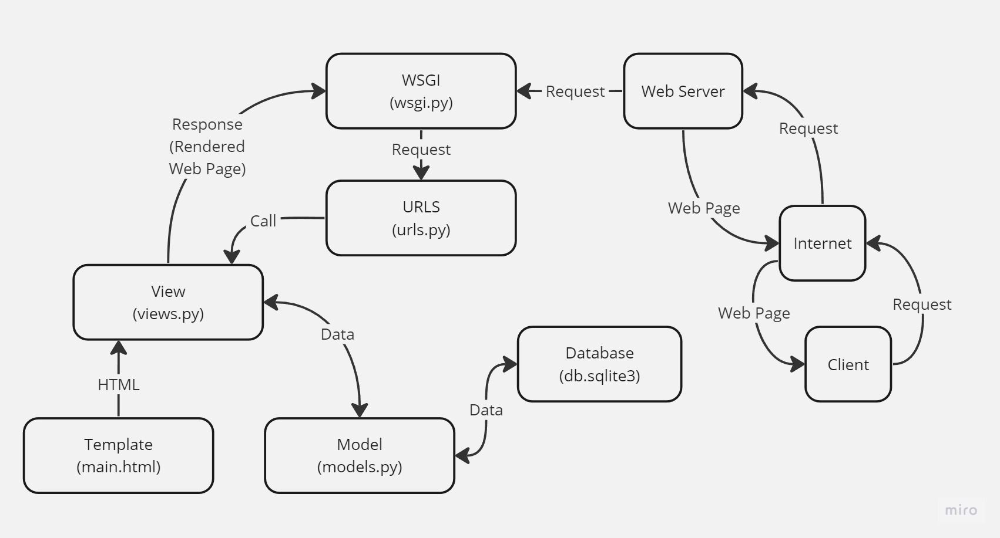

# Library Management System

🌐[Link Aplikasi](https://library-app.adaptable.app/main/)🌐

Nama: Fahmi Ramadhan<br>
NPM: 2206026473<br>
Kelas: PBP A<br>

## Implementasi _Checklist_

### 1. Membuat sebuah proyek Django baru.
Pertama-tama, saya membuat repositori GitHub baru bernama `library-app` dengan visibilitas _public_.
Setelah itu, saya membuat direktori lokal baru bernama `library_app` dan menginisiasi direktori tersebut sebagai repositori Git, menghubungkan repositori lokal dengan repositori GitHub, serta menambahkan _file_ `.gitignore`.
Kemudian, saya membuat _virtual environment_ pada direktori tersebut dengan menjalankan perintah berikut: <pre>python -m venv env</pre>
Selanjutnya, saya aktifkan _virtual environment_ tersebut dengan menjalankan perintah berikut: <pre>env\Scripts\activate.bat</pre>
Dalam _virtual environment_ tersebut, saya meng-_install_ _dependencies_ dari berkas `requirements.txt` yang berisi:
```
django
gunicorn
whitenoise
psycopg2-binary
requests
urllib3
coverage
```
dengan menjalankan perintah berikut: <pre>pip install -r requirements.txt</pre>
Setelah semua _dependencies_ ter-_install_, saya mulai membuat proyek Django dengan menjalankan perintah berikut: <pre>django-admin startproject library_app .</pre>
Setelah proyek dibuat, saya menambahkan `*` pada `ALLOWED_HOST` di `settings.py` agar aplikasi dapat diakses secara luas.

### 2. Membuat aplikasi dengan nama `main` pada proyek tersebut.
Untuk membuat aplikasi dengan nama `main`, saya menjalankan perintah berikut: <pre>python manage.py startapp main</pre>
Kemudian, saya menambahkan `'main'` pada `INSTALLED_APPS` di `settings.py` yang ada di direktori `library_app`.

### 3. Membuat model pada aplikasi `main` dengan nama `Item`.
model saya memiliki atribut sebagai berikut:
```python
class Item(models.Model):
    name = models.CharField(max_length=255)
    author = models.CharField(max_length=255)
    category = models.CharField(max_length=255)
    amount = models.IntegerField()
    description = models.TextField()
```
Selanjutnya, saya menjalankan perintah berikut untuk membuat migrasi model dan menerapkan migrasi tersebut ke dalam basis data lokal.
```
python manage.py makemigrations
python manage.py migrate
```
### 4. Membuat sebuah fungsi `views.py` untuk dikembalikan ke dalam sebuah _template_ HTML.
Dalam tahap ini, saya membuat fungsi `show_main` pada `views.py` untuk me-_render_ tampilan HTML dengan menggunakan data yang diberikan.
```python
from django.shortcuts import render

def show_main(request):
    context = {
        'app_name': 'Library Management System',
        'student_name': 'Fahmi Ramadhan',
        'class': 'PBP A',
        'name': 'Operating System Concepts',
        'author': 'Abraham Silberschatz, Peter B. Galvin, and Greg Gagne',
        'category': 'Computer Science',
        'amount': '10',
        'description': 'Operating System Concepts book is an informative guide to operating systems with an overview of all the major aspects. The book deals with topics like computer process, operating systems and their functioning, and design. It also looks at special-purpose systems, storage management, security, distributed systems and memory.'
    }

    return render(request, "main.html", context)
```
Selanjutnya, saya membuat _file_ `main.html` pada direktori `templates` di aplikasi `main` dan mengisinya untuk menampilkan nama aplikasi,
identitas saya, dan lainnya dari _dictionary_ `context` sebagai berikut:
```html
<h1>{{app_name}}</h1>

<h2>{{student_name}} - {{class}}</h2>

<p><strong>Name: </strong>{{name}}</p>
<p><strong>Author: </strong>{{author}}</p>
<p><strong>Category: </strong>{{category}}</p>
<p><strong>Amount: </strong>{{amount}}</p>
<p><strong>Description: </strong>{{description}}</p>
```

### 5. Membuat sebuah _routing_ pada `urls.py` aplikasi `main` untuk memetakan fungsi yang telah dibuat pada `views.py`.
Untuk membuat sebuah _routing_ yang memetakan fungsi `show_main` pada `views.py`, saya membuat _file_ `urls.py` yang berisi:
```python
from django.urls import path
from main.views import show_main

app_name = 'main'

urlpatterns = [
    path('', show_main, name='show_main'),
]
```

### 6. Melakukan _routing_ pada proyek agar dapat menjalankan aplikasi `main`.
Saya mengonfigurasi _routing_ URL proyek dengan menambahkan _path_ yang mengarah ke aplikasi `main` pada `urls.py` di direktori `library_app`.
```python
from django.contrib import admin
from django.urls import path, include

urlpatterns = [
    path('admin/', admin.site.urls),
    path('main/', include('main.urls')),
]
```

### 7. Melakukan _deployment_ ke Adaptable terhadap aplikasi yang sudah dibuat.
Untuk melakukan _deployment_ ke Adaptable, saya login ke [Adaptable.io](https://adaptable.io/) dengan menggunakan akun GitHub yang saya gunakan untuk membuat proyek. Kemudian, saya menghubungkan repositori proyek `library_app` ke Adaptable untuk membuat aplikasi baru di Adaptable. Saya memilih `Python App Template` sebagai _template deployment_ dan `PostgreSQL` sebagai tipe basis data yang digunakan. Selanjutnya, saya mengonfigurasikan versi Python dan _start command_. Kemudian, saya memasukkan nama aplikasi `library-app` yang akan menjadi _domain_ situs web aplikasi saya. Terakhir, saya centang bagian `HTTP listener on PORT` dan klik `Deploy App` untuk memulai proses _deployment_ aplikasi.

## Bagan _Client Request and Response_ Aplikasi Web Berbasis Django



1. _Client_ mengakses website dan _Web Server_ menerima _request_.
2. WSGI memproses server HTTP untuk situs web berbasis Python.
3. `urls.py` berisi path yang mengarahkan _request_ ke fungsi pada `views.py`.
4. `views.py` mengambil data dari `models.py` dan me-_render_ HTML dari _template_.
5. `models.py` berisi _class_ `model` untuk mengelola data pada _database_.

## Mengapa Menggunakan _Virtual Environment_?

